## 1.前言
fft模块可以称得上是信号题中最基础,也是最重要的模块了,大部分电赛题目中,都需要进行fft操作。基本上是信号题中的家是本。然而我们队伍中现役的fft系列模块,虽然经历了多次重构,但还是积攒了很深的历史遗留问题。因此在有了一定的DSP基础知识后,终于下定决心,在增加一些新算法的同时,对FFT模块进行彻底的重构,重构的预期目标为:
 - 将原本与stm32紧耦合的fft模块算法移植到Xlinx fpga的PS端
 - 添加Rife / Parabolic / Candan 插值算法,增强频率,相位,幅值测量准确度
 - 重构窗函数算法,减小频谱泄漏
 - 正确处理扫频时产生的fft数据,构建扫频管线
 - 定点数重构,抛弃原来32上的基于f32的算法,更适配fpga逻辑管线
 - 将算法层和硬件层彻底解耦
## 2. 算法流程仿真
### 2.0 测试框架设计
根据ai提示,给出了我们整个项目的框架

```
fft_lab/
├── signals.py           # 信号生成器（对标：你将来往 FFT 喂的数据）
├── windows.py           # 窗函数库（对标：中间件层的窗函数模块）
├── estimators.py        # 频率/幅度/相位估计算法（对标：顶层算法层）
├── metrics.py           # 误差计算与统计（RMSE、MAE、bias）
└── tests/
    ├── test_windows.py       # 窗函数正交性/相干增益测试
    ├── test_parabolic.py     # 抛物线插值精度测试
    ├── test_rife.py          # Rife 算法全面测试
    ├── test_candan.py        # Candan 算法全面测试
    ├── test_harmonics.py     # 谐波分析（三角波场景）
    └── test_two_tone.py      # 双音分辨测试（2023-H 场景）
```

我个人认为其逻辑基本正确。
#### 2.0.1 信号生成程序 `signals.py`
首先来处理最基础的部分: `signals.py` 首先是生成信号接口,
```python
@dataclass
class ToneParams:
#单路信号参数
    freq_hz: float
    amplitude : float #归一化幅度
    waveform : str = "sine" #波形, sine | traiangle | square,默认sine
    phase: float = 0 #相位
@dataclass
class ChannelParams:
#信道参数
    snr_db: float | None = None
    seed: int = 42

@dataclass
class ADCParams:
    adc_scale: float #adc量程
    quantized_acc: int #量化精度
    fs_hz: float = 1e6 #采样率
    n_samples: int = 1024 #采样点数
	sampled_time: int = 1000 #采样时间,单位ms

def generate_test_signal(
    tones: list[ToneParams],
    channel: ChannelParams,
    adc: ADCParams 
) -> tuple[np.ndarray, dict]:
#返回(信号数组,元信息字典)
```
该函数旨在模拟adc采样后的数据(定点数)。
函数的参数分为三个数据类(可以理解为C语言中的结构体),模拟了物理信号链路中的三个部分:
`ToneParams`: 信号发生器产生的信号
`ChannelParams`: 信号合路后的信道噪声
`ADCPparams`: 最终ADC的采样参数
这里幅值采用了归一化幅值,便于进行后面的信号幅值溢出情况的处理。
最后模拟过程如下:多路信号(接收ToneParams列表) - 加法器信道(添加信道噪声) - ADC(ADC量化),最终输出的是ADC量化后的合成信号。

>注:snr使用的是dB计数法,计算公式为$SNR(dB) = 10 \times \log_{10}{\frac{P_{signal}}{P_{noise}}}$,对于离散信号,功率的计算公式为$P = \frac{1}{n} \sum|x[n]|^2$ 
>例:snr=10意味着信号功率是噪声的10倍。
>注2:程序中的adc_scale参数指的是adc能够测量的最大电压,这里模拟的adc为类似max5885的对称量程adc(如量程-2V-2V),stm32板载adc这种非对称量程adc受限于本人水平暂时不会模拟(不过其实区别不大)

接着处理生成信号的部分,这里使用了一种类似策略模式的方法:将调用的波形名称作为字典键,函数作为字典值。
``` python
_WAVEFORM_GENERATORS = {
    "sine":    lambda t, f, A: A * np.sin(2 * np.pi * f * t),
    "triangle": lambda t, f, A: A * (2/np.pi) * np.arcsin(np.sin(2*np.pi*f*t)),
    "square":  lambda t, f, A: A * np.sign(np.sin(2*np.pi*f*t)),
}
```
(以上代码由AI生成,使用正弦波,三角波,方波公式进行信号生成)
这种方法的优点是:如果今后需要增加新的函数生成方法,只需要添加一组新的键值就好了,比如我们要加入一组生成直流信号的函数,只需要添加一行
```python
"dc": lambda b: b
```

因为采样流程相对固定(生成信号-加入信道噪声-ADC量化采样),所以在`generate_test_signal`直接将代码写成了紧耦合的。
```python
def generate_test_signal(
    tones: list[ToneParams],
    channel: ChannelParams,
    adc: ADCParams 
) -> tuple[np.ndarray, dict]:
#返回(信号数组,元信息字典)
    Ts = 1 / adc.fs_hz
    t_seq = np.arange(0,adc.sampled_time,Ts)
    sumed_signal = np.zeros(len(t_seq))
    for i in tones: #返回信号加和
        sumed_signal += _WAVEFORM_GENERATORS[i.waveform](
            t = t_seq,
            f = i.freq_hz,
            A = i.amplitude,
            phi = i.phase
        )
    #添加信道噪声
    rng = np.random.default_rng(channel.seed)
    P_signal = np.mean(sumed_signal ** 2)
    if channel.snr_db:
        P_noise = P_signal / (10 ** (channel.snr_db / 10))
        noise = np.sqrt(P_noise) * rng.standard_normal(len(sumed_signal))
        sumed_signal += noise
    #ADC采样部分
    #数据切片
    if len(sumed_signal) < adc.n_samples:
        for i in range(adc.n_samples - len(sumed_signal)):
            np.append(sumed_signal,0) #如果信号数小于采样点数,默认填充0
    sumed_signal = sumed_signal[0:adc.n_samples]
    #处理超过采样范围的幅值,超过采样范围的复制设定为峰值(模拟削顶削底效应)
    for i in range(len(sumed_signal)):
        if sumed_signal[i] >= 1:
            sumed_signal[i] = 1
        elif sumed_signal[i] <= -1:
            sumed_signal[i] = -1
    
    #ADC量化采样
    quantized_signal = np.zeros(len(t_seq))
    for i in range(len(sumed_signal)):
        quantized_signal[i] = int(sumed_signal[i] * ((adc.quantized_acc - 1) // 2))

    #信号元数据字典
    signal_data = {
        "tone": tones,
        "channel": channel,
        "adc": adc
    }
    return (quantized_signal,signal_data)
```
后面添加了信号元数据输出,方便后续测试脚本进行自动化测试。
#### 2.0.2 统计函数库 `metrics.py`
为了方便后续测试,此时准备了相关的数据统计库,用于测试算法分析与实际情况的误差,以便进行量化分析,以下为函数表:
| 函数名称 | 含义 | 作用 |
| ----- | :---: | ------ |
| rmse() | 均方根误差 | 测试信号估计值与实际值偏差,对异常值敏感,能够反应预测误差的分布状况 |
| mae() | 平均绝对误差 | 对异常值不敏感,更鲁棒 |
| bias() | 偏差 | 可以反应信号总体偏差状况,是总体偏高还是偏低 |
| std_dev() | 标准差 | 分离系统误差和随机误差,观察噪声情况 |
| reltave_error_pct() | 相对误差百分比 | 反应每一次的估计值与实际值偏差(返回的是数组) |
| max_abs_error() | 最大绝对误差 | 用来分析极端情况 |
| signal_rmse() | 两路信号的均方误差 | 用于评估重建信号的质量 |
| signal_correlation() | 两路信号的相关系数 | 越接近1说明两路信号相关性越强(越相似) |
| signal_nmse_db() | 两路信号的归一化均方误差 | 评估重建信号质量 |
| compute_snr() | 计算信噪比 | 计算信号的信噪比,需要一路干净(无噪声)的信号 |
| estimate_noise_floor | 计算噪声底 | 计算系统的底噪(无信号输入时的固有噪声),需要信号频率范围 |

函数库代码基本上就是根据公式进行计算,不过个人感觉用代码表示还是比用公式表示略微直观一点,所以这里也贴出例码供参考
```python
import numpy as np
#1.标量误差统计
def rmse( #均方根误差
    estimates: np.ndarray,
    truth: float | np.ndarray 
) -> float:
    return float(np.sqrt(np.mean((estimates - truth) ** 2)))

def mae( #平均绝对误差
    estimates: np.ndarray,
    truth: float | np.ndarray
) -> float:
    return float(np.mean(np.abs(estimates - truth)))

def bias(
    estimates: np.ndarray,
    truth: float | np.ndarray
) -> float:
    return float(np.mean(estimates - truth))

def std_dev(#标准差
    estimates: np.ndarray
) -> float:
    return float(np.std(estimates, ddof=1))

def reltave_error_pct(#相对误差百分比
    estimates: np.ndarray,
    truth: float
) -> np.ndarray:
    return np.abs(estimates - truth) / np.abs(truth) * 100.0

def max_abs_error(#最大绝对误差
    estimates: np.ndarray,
    truth: float
) -> float:
    return np.max(np.abs(estimates - truth))


#2.波形误差估计统计
def signal_rmse(#两路信号的均方根误差
    sig_est: np.ndarray,
    sig_true: np.ndarray
) -> float:
    return np.sqrt(np.mean((sig_est - sig_true) ** 2))

def signal_correlation(#信号的皮尔逊相关系数
    sig_est: np.ndarray,
    sig_true: np.ndarray
) -> float:
    return np.corrcoef(sig_est, sig_true)[0, 1]

def signal_nmse_db(#归一化均方误差(dB)
    sig_est: np.ndarray,
    sig_true: np.ndarray
) -> float:
    mse = np.mean((sig_est - sig_true) ** 2)
    power = np.mean(sig_true ** 2)
    return 10.0 * np.log10(mse / power) if power > 0 else -np.inf

#3.辅助工具函数
def compute_snr(#计算信噪比
    sig_est: np.ndarray,
    sig_clean: np.ndarray
) -> float:
    noise = sig_est - sig_clean
    p_noise = np.mean(noise ** 2)
    p_signal = np.mean(sig_clean ** 2)
    return 10 * np.log10(p_signal / p_noise) if p_noise > 0 else np.inf

def estimate_noise_floor(#计算噪声底
    spectrum: np.ndarray,
    signal_bins: list[int]
) -> float:
    mask = np.ones(len(spectrum), dtype=bool)
    for b in signal_bins:
        mask[max(0, b-3): min(len(spectrum), b+4)] = False
    return float(np.mean(spectrum[mask])) if np.any(mask) else 0.0
```
通过简单的测试(生成一个带噪声的正弦信号,测量其频谱,SNR等相关参数),能够验证以上两个测试代码的有效性。至此,我们能够进行进一步的算法仿真工作了。
### 2.1 窗函数对比实验
这一节中,我们要分析五种不同窗函数的性质,将其量化成为表格,并且作为在电赛时我们选择窗函数的依据。

#### 2.1.1 五种窗函数的实现
使用了`scipy.signal.windows` 中的函数,来实现不同窗函数,并使用了类似在`signals.py`中类似的策略模式实现不同的窗函数。这样,通过调用字典索引,就可以方便使用键来生成对应的窗函数。目前已实现了rect(矩形窗),hann,hamming,blackmanharris,flattop五种窗。
``` python
_WINDOWS_GENERATORS = { #窗函数生成字典
        "rect": lambda pts: np.ones(pts),
        "hann": lambda pts: scipy.signal.windows.hann(pts, sym=False),
        "hamming": lambda pts: scipy.signal.windows.hamming(pts, sym=False),
        "blackmanharris": lambda pts: scipy.signal.windows.blackmanharris(pts, sym=False),
        "flattop": lambda pts: scipy.signal.windows.flattop(pts, sym=False)
        }

```
这里`sym=False`的含义是生成周期窗(用于fft频谱分析),而并非对称窗。

#### 2.1.2 窗函数关键参数的测量
1.**相干增益(coherent gain)**:相干增益,可以简单理解为窗函数会将信号幅值乘以一个系数,为了修正窗函数对幅值的影响,我们需要将生成的频谱除以这个系数来进行矫正。求相干增益的方法也很简单,就是对窗函数求平均值,以下为代码示例:
```python
def measure_coherent_gain (window: np.ndarray) -> float: #求相干增益，用于矫正幅值
    return float(np.mean(window))
```
2.**扇贝损失(scalloping_loss)**:指的是频率分量处在非整数bin上时带来的幅值衰减问题,信号的频率分量在两bin中间位置时衰减最大(具体的解释过程可以参考Lyons的`《Understanding digital siginal processing》`中的窗函数/频谱泄漏一节),这个反应了窗函数最大会让幅值衰减多少。
扇贝损失的测量方法相较于相干增益略微复杂,不过其逻辑仍旧是简单的。大概分为以下步骤
- 找到一整数bin(无扇贝损失),测量其幅值大小
- 在这个整数bin和下一个bin之间,找到幅值衰减最大的频率分量
- 测量衰减dB数
以下为示例代码:
```python
def measure_scalloping_loss (window: np.ndarray,#求扇贝损失，用于检查数据的误差上限
                             N_fft: int,
                             n_sweep=500#扫频步长，越小越精确
                             ) -> float:
    N = len(window)
    n = np.arange(N)
    k0 = N_fft // 4 #远离DC分量
    s = np.sin(2 * np.pi * k0 / N_fft * n)
    X = np.fft.fft(s * window, n=N_fft)
    peak_ref = np.max(np.abs(X))
    min_peak = float('inf')
    peak = 0
    for offset in np.linspace(0, 1.0, n_sweep):
        s = np.sin(2 * np.pi * (k0 + offset) / N_fft * n)
        X = np.fft.fft(s * window,n=N_fft)
        peak = np.max(np.abs(X))
        if peak <= min_peak:
            min_peak = peak
    scalloping_loss = -20 * np.log10(min_peak / peak_ref)
    return float(scalloping_loss)


```

> 注:为了尽量减少fft的栅栏效应所产生的影响,我们在测量幅值时,往往采取过采样(oversample)的方法。即通过末尾补0(可以提升频率分辨力)的方法,来减少这个影响。习惯中,一般是补齐到原数组长度的64倍/128倍
> 注2:末尾补0的对fft的影响仍然可以在Lyons中的《Understagding digital signal processing》中学习

#### 2.1.3  窗函数性能指标评估
为了明确窗函数的选择情景,采取了以下几条测试
- 窗函数基本特性,相干增益和扇贝损失
- 窗函数主瓣(mainlobe)宽度(bins)
- 窗函数最大旁瓣(dB)
- 频偏-幅偏曲线
- 频率分辨力测试
##### 2.1.3.1  幅值影响
本次测试中通过以下几个指标来衡量窗函数对幅值的影响
 - 相干增益和扇贝损失
 - 频偏-幅偏曲线
**相干增益**:反应了信号加窗后的增益(一般小于1),可以简单的矫正信号的幅值。
**扇贝损失**:反应了信号在两个bin之间时出现的幅值衰减现象(不可通过简单的增益矫正)
简而言之,扇贝损失越小越好。

| 窗函数 | 相干增益 | 扇贝损失(dB) |
| --- | :---: | ---|
| rect(矩形窗) | 1.0 | 3.905 |
| hann | 0.5 | 1.417 |
| hamming | 0.54 | 1.744 |
| blackmanharris | 0.35875 | 0.822 |
| flattop | 0.2155 | 0.0096 |

由上述表格可以看出,flattop对于幅值的还原程度是最好的,能够最好还原各个频点处的幅值。
接着,我们来看一看两个bin之间的频偏-幅值曲线,并不是所有的窗函数的幅偏-频偏曲线,都是像dsp教材中讲的,像一个扇贝。

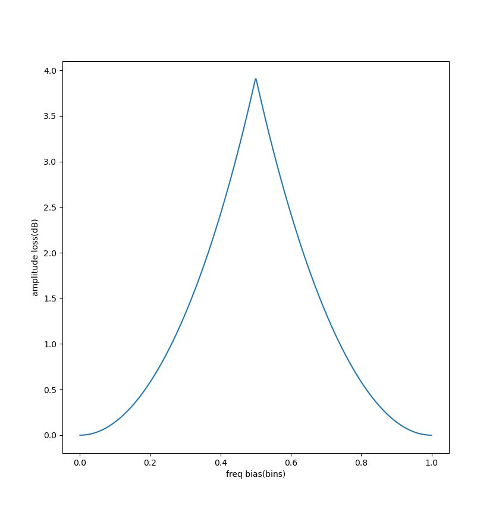
<center> 图1 矩形窗的幅偏-频偏曲线 </center>

由图1可以看出,矩形窗的曲线就是典型的"扇贝形",符合教科书的定义,中间的幅值衰减最大。
hann窗,hamming窗。blackmanharris窗的形状都与矩形窗形状类似,只不过最大衰减不同,所以这里就不放出了。
接着,我们来看一个特殊的--flattop窗,这个窗为了保证幅值准确性,付出了很多代价

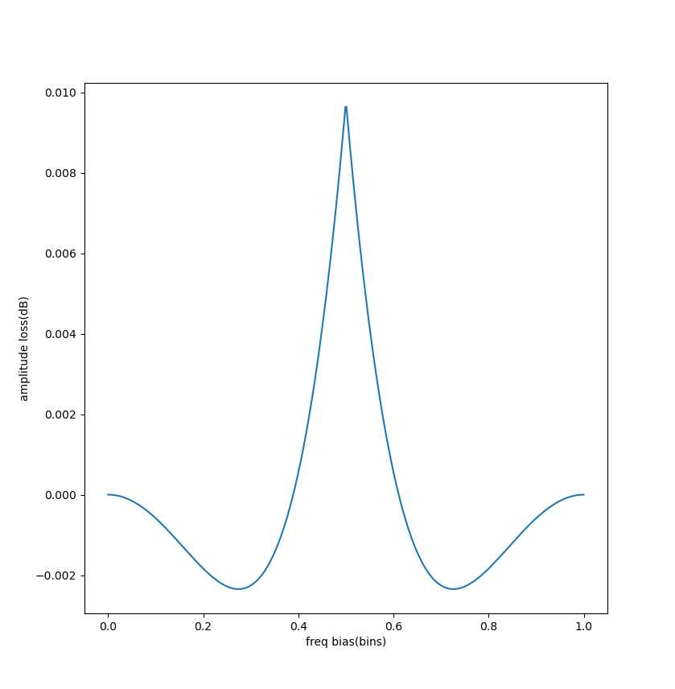
<center> 图2 flattop的频偏-幅偏曲线 </center>

可以看到,在峰值的两侧,与矩形窗的图像出现了一定区别。

##### 2.3.1.2频率分辨率影响
测试通过以下几个指标来明确窗函数对频率分辨率的影响
 - 主瓣(mainlobe)宽度
 - 最大旁瓣(sidelobe)高度
 - 双音测试
**主瓣宽度(bins)**: 反应了窗函数的频率分辨力,一般来说主瓣越窄越好,这意味着在同等fft参数(即同样的采样率,同样的采样点数下),能够分清更近的两条谱线,因此,主瓣宽度越小越好
>注:本文中主瓣宽度为3dB宽度,非常见的零-零宽度/零-零半宽,故相对零-零半宽偏小

**最大旁瓣高度(dB)**: 反应了旁瓣的衰减能力,值越小(或者说绝对值越大,因为是负数),越好,这个数字越小意味着对频谱泄漏的抑制效果越强。
以下为几个窗函数的主瓣宽度和最大旁瓣高度

| 窗函数 | 主瓣宽度(bins) | 最大旁瓣高度(dB) |
| --- | :---: | --- |
| rect | 0.88 | -13.2 |
| hann | 1.43 | -31.5 |
| hamming | 1.30 | -42.7 |
| balckmanharris | 1.88 | -92.0 |
| flattop | 3.72 | -93.0 |

> 注:宽度为bins的单位如果需要像算出其持续了多少频率需要知道信号的采样率和fft点数,计算方法是:$freq = bins \cdot \frac{samplerate}{pts}$

可以看到:旁瓣衰减上,flattop与blackmanharris表现最好,这意味着它们对频谱泄漏的抑制效果较强,但是它们的主瓣,尤其是flattop的主瓣非常宽,这导致了其频率分辨力的下降。
主瓣宽度和旁瓣高度之间需要进行取舍,因为没有任何一个窗能够同时满足窄主瓣和低旁瓣的条件。
接着来看看双音分辨测试,其测试内容如下:
 - 生成两个正弦波信号,不断拉长彼此的距离
 - 取频谱中的最大值和第二大值,求出VPR(峰谷比),(区间内最小峰值与区间内最小值之比)
 VPR越小,意味着频率分辨力越好,相反,如果VPR越大,意味着很难分清两个频率分量。
 本次测试中,两个正弦波的采样信号参数为:采样率1Mhz,采样点数1024点,adc量化精度16bit。同时为模拟真实环境进行了加噪处理,SNR=10dB

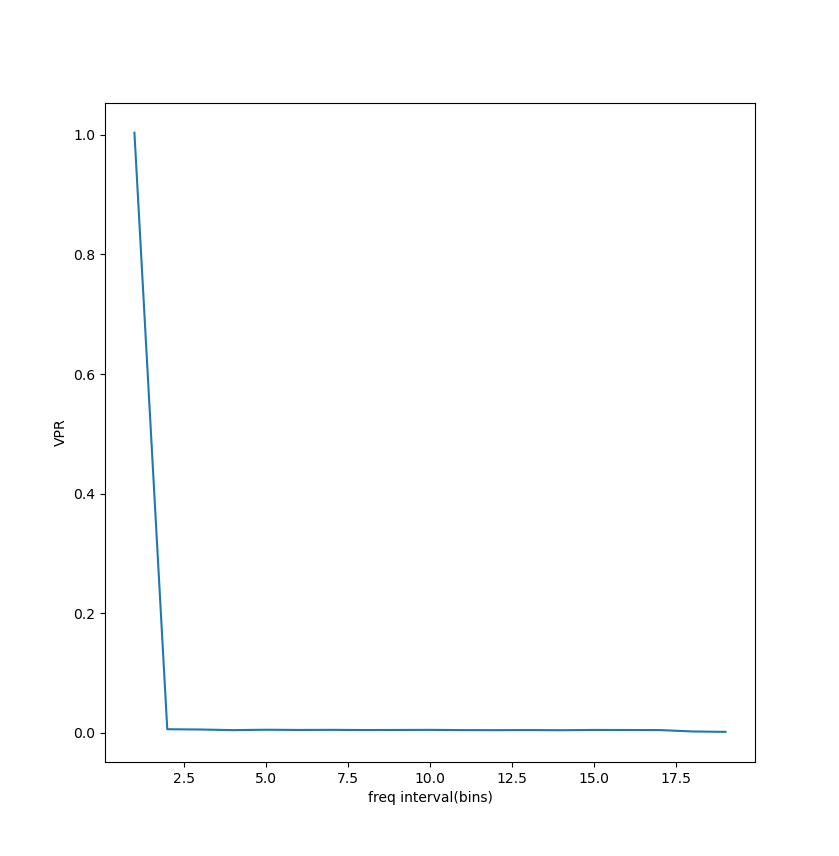
<center> 图3 矩形窗的频率间隔-VPR图 </center>

图3反应了在信号频率分量与fft网格对齐的情况(即信号本身没有频谱泄漏)的情况下,直接取最大频点和次大频点的VPR。可以看到,如果是矩形窗,在两个频率分量间隔2bins时即可识别对应的分量。
以下为无频谱泄漏时,让VPR曲线进入稳态所需的分量间隔

| 窗函数 | 分量间隔 |
| --- | --- |
| rect | 2 |
| hann | 4 |
| hamming | 4 |
| blackmanharris | 6 |
| flattop | 无法进入 |

由此可见,如果频谱泄漏情况较小(大部分信号都能与fft网格对齐),不加窗实际上才是最优解。

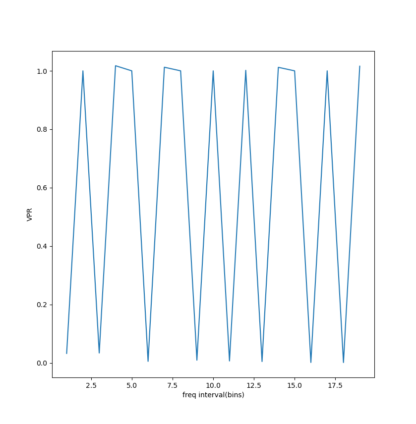
<center> 图4 hann窗在频率未对齐的情况下的频率间隔-VPR图 </center>

但是,当有频谱泄漏时,情况便非常的不同,所有窗函数的频率间隔-VPR图都如图4所示,如果单纯的只靠取最大点和次大点根本无法收敛。因此,当我们预计频谱泄漏严重时,在分离不同频率分量时,除了处理幅值的变化,我们还应对某一频点附近泄漏的频谱进行处理(如标明频点附近的r bin区域内,不参与次大频点的查找),具体内容参见2.4节

综上,在电赛情况下,如果需要均衡,选择hann窗或者hamming窗均可,不错的最大扇贝损失,较低的主瓣宽度和旁瓣高度,都是选择它们的理由。在这两者的抉择中,如果对频率分辨力要求较高,选择hann窗,如果对幅值还原程度要求比较高,选择hamming窗。
当对幅值精度要求较高,对频率分辨力没有过高要求时(比如采样点数很多时),选择blackmanharris或flattop窗,它们对幅值的还原程度都非常高。这两个具体选哪个取决于你对频率分辨力的接受程度,如果你完全不在乎,选择flattop,如果你还在乎一点,选blackmanharris。

### 2.2 抛物线插值矫正幅值
#### 2.2.1 原理简介
上一节中,我们简单介绍了扇贝损失和栅栏效应,它会导致fft算法的频率估计偏差和赋值估计偏差。(这两个效应的具体探讨仍然可以参照Lyons的《Understading digigal signal Processing》)。
这一节,我们来探讨缓解频率偏差和幅度偏差的方法。
为了了解这些方法,我们需要先简单了解一下为什么栅栏效应会导致频率和幅值的估计偏差。
**扇贝损失**: 如`2.1.3.1 图1` 所示,在两个bin间的频率会出现幅值衰减的情况
**栅栏效应**: 因为fft是离散的,所以导致落在两频率bin之间的频率会被归到离它最近的bin内。
导致这种效应的原因,是冲激信号的频域变换并非是冲激信号。以矩形窗为例,冲激信号的频域变换是sinc函数。抛物线插值法的原理,就是利用二次函数(抛物线)来拟合频率bin附近的三点。因此,窗函数的主瓣(mainlobe)越接近完美的二次函数,插值效果越好(一般进行抛物线插值算法时,我们对信号使用**hann**窗处理)

> 注:如果对原理感兴趣,可以去阅读Grandke, T. 的《Interpolation Algorithms for Discrete Fourier Transforms of Weighted Signals》(1983), 里面详细记载了抛物线插值的原理以及使用的窗函数。

#### 2.2.2 代码实现
 公式推导这里就跳过了,抛物线插值法主要分为以下步骤:
  1. 找到频率bin及其邻近bin
  我们这里需要的是频率bin(如果只有一个频率峰值的话,直接取频谱最大值索引就好,如果有多个的话,需要设计算法求出每个频率分量的频率bin)。
  找到它,记作$k_0$,它的幅度记作$y_{0}$。它前一个点的幅度记作$y_{-1}$ , 后一个点的幅度记作$y_{+1}$ 。
  2. 通过公式算出实际频率和实际幅值
  频率差 $\delta = \frac {\frac{1}{2} (y_{-1} - y_{+1})}{y_{-1} - 2 y_0 + y_{+1}}$
  实际频率bin为 $f_{est} = k_0 + \delta$
  实际幅值为抛物线的峰值,计算公式为 $y_{peak} = y_0 - a \delta^2$ ,其中$a = y_{-1} + y_{+1} - 2 y_0$
  3. 通过fft点数,采样率,相干增益(coherent gain)矫正得到实际幅值和实际频率.
 实际频率 $f_{real} = f_{est} \cdot \frac{f_s}{N}$ ,
 实际幅度 $A_{real} = \frac{y_{peak}}{N \cdot G_c}$
 以下为代码实现:
 ```python
def parabolic_interp(
                    spectrum: np.ndarray, #幅度谱,必须是线性幅度谱，不能是分贝谱
                     peak_bin: int, #峰值bin
                     fs_hz: float,
                     n_pts: int,
                     coherent_gain: float
                     ) -> EstimateData:
    if peak_bin < 1 or peak_bin > len(spectrum) - 2:
        print("[ERROR] peak bin is too small or too large")#简单的错误处理
        return EstimateData(freq_estimated=0,amplitude_estimated=0)
    y_minus1 = spectrum[peak_bin - 1]
    y_0 = spectrum[peak_bin]
    y_plus1 = spectrum[peak_bin + 1]
    freq_delta = 0.5 * (y_minus1 - y_plus1) / (y_minus1 - 2 * y_0 + y_plus1)
    a = (y_minus1 + y_plus1 - 2 * y_0)#抛物线方程中的a
    y_peak = y_0 - a * (freq_delta ** 2)
    freq_estimated_bin = (peak_bin + freq_delta) * (fs_hz / n_pts)
    amplitude_estimated = y_peak / (n_pts * coherent_gain)
    output_EstimateData = EstimateData(
            freq_estimated=freq_estimated_bin,
            amplitude_estimated=amplitude_estimated
            )
    
    return output_EstimateData
 ```
因为后面还需要写其他的频率/幅值估计算法,所以这里定义了一个dataclass:EstimateData来统一返回值的结构
```python
@dataclass
class EstimateData:
    freq_estimated: float
    amplitude_estimated: float
```

#### 2.2.3 测试结果
为了验证插值法的具体性能,我做了以下几项测试:
 - **扫频测试**:绘制频偏-RMSE曲线,反应频率估计值,幅度估计值随频率偏差的变化,扫频测试中,生成的测试信号采样率为1Mhz,采样点数1024点,量化精度16bit,SNR=10,测试范围为$\delta  \in [0.0 , 0.5)$ 步长0.01(单位:bin)
 - **SNR测试**: 绘制SNR-RMSE曲线,反应频率估计值和幅度估计值随SNR的变化,生成的信号频偏$\delta = 0.3 bin$ ,采样率1Mhz,采样点数1024点,量化精度16bit,测试范围$SNR \in [0.0,60)$ ,步长5dB。
1. 扫频测试结果

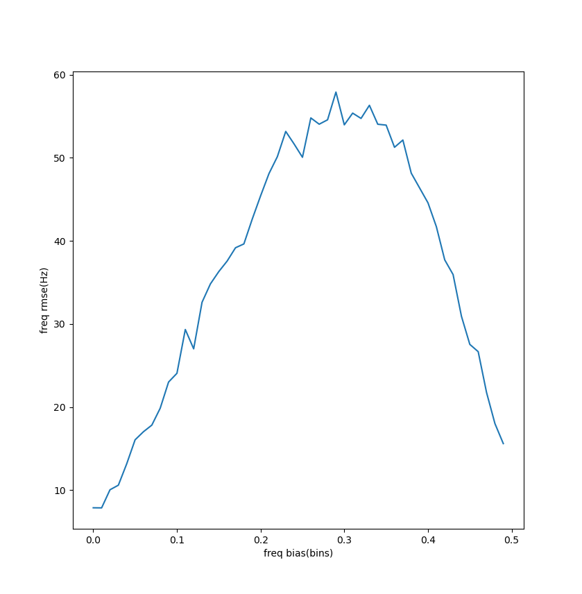
<center> 图5 频偏-频率估计rmse图像 </center>

如图5所示,频偏为0是rmse约在5Hz左右。rmse在$\delta = 0.3$ 时最大,约在60Hz左右。

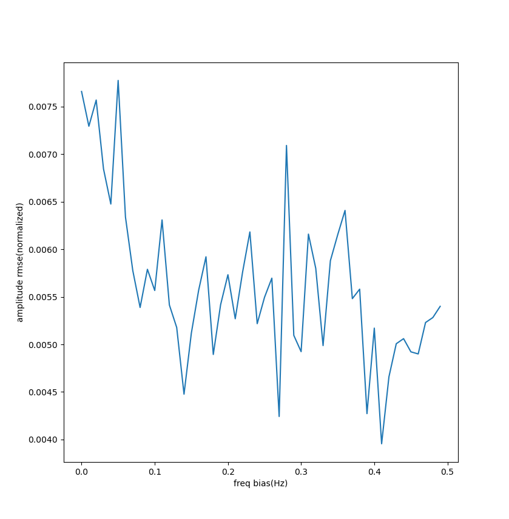
<center> 图6 频偏-幅度估计rmse图像</center>

幅值方面,可以看到幅值最大rmse约在0.0075左右,但是波动较大,建议按最大rmse去进行设计。

> 注:这里幅度rmse采用了一种特别的计算方法,由于最开始的信号序列经过16bit量化,所以这里为了更直观采用了一种特殊的"归一化幅值",即将rmse除以$2^{16}$ 来更直观的体现幅值误差。这种计算方式也适用与下文中的SNR测试结果

2. SNR测试结果

<center> 图7 SNR-频率估计rmse图像</center>

频率rmse普遍维持在50-60Hz左右,且可以看到随着snr的升高频率rmse逐渐稳定在52Hz左右。因此,在实践中,最好保持SNR ≥ 10dB。

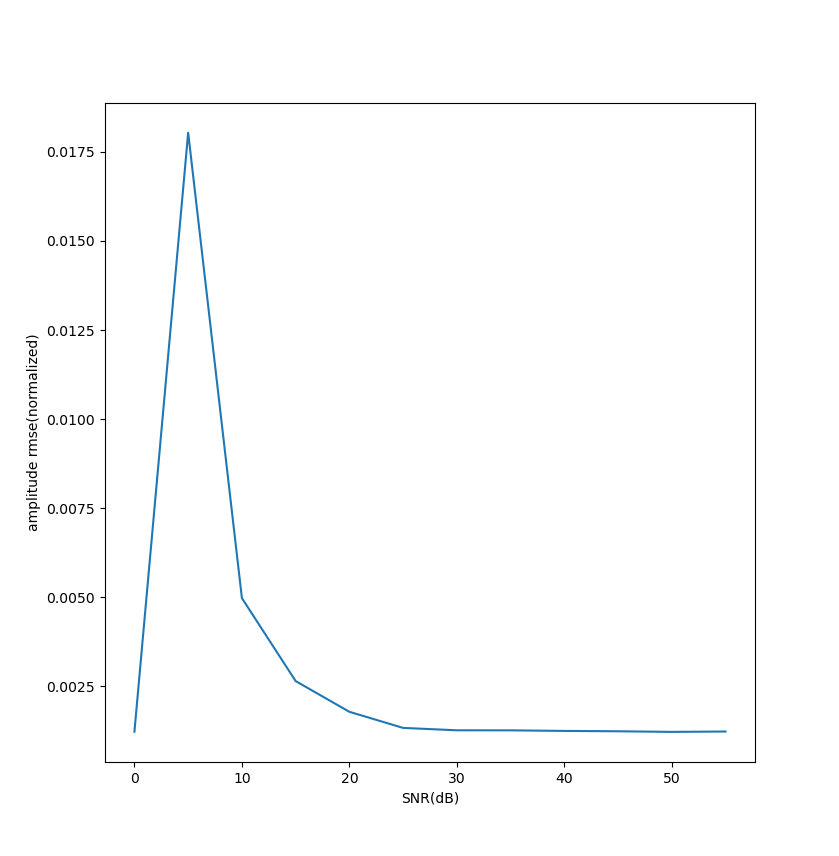
<center> 图7 SNR-幅度估计rmse图像 </center>

幅度方面,随着snr的升高,在snr=10时效果已经较好,归一化幅值rmse大约在0.003左右。在snr>=20时基本上趋于稳态,在0.001到0.002左右

### 2.3 多帧平均策略
DSP教材中提到过,对信号进行信号平均(Signal Averaging)可以显著提升信号的SNR指标,有助于从噪声中分离出微弱信号。对于周期信号,一般的平均方法有:相干平均与非相干平均(当然还有其他方法,比如滑动平均,指数平均等)
**相干平均**: 将多个周期片段叠加,按同一相位点对齐进行平均。这个有点类似中学物理实验中经常用到的"多次测量后取平均能消除偶然误差"的情况

**非相干平均**: 只对信号的幅度/功率进行平均,因此会丢失相位信息。
这两个平均算法,都需要保证多次采样都需要保证多次采样的信号是同步的(非相干采样需要周期参考),这意味着我们需要通过设置硬件触发/软件设置以对齐多个采样窗口。在没有硬件触发的情况下,在嵌入式端实现此操作较为困难。
另外,电赛场景下信号的SNR普遍较高,个人估计下,信号平均对SNR的提升对整体结果的影响很有限。
让ai帮我整理了一下往年优秀国奖作品的代码,和我的猜想一致,我查询到的开源国奖代码中,均未使用信号平均算法。故做出以下结论:
仿真阶段,跳过信号平均,但在嵌入式开发阶段预留信号平均接口,等有需要的时候再实现。

### 2.4正确寻找频率bin
在fft后处理的过程中,我们很容易发现:如何正确的寻找频率bin是个问题。不同于理想的fft/dft情况。由于频谱泄漏和噪声等原因,频率分量不一定会集中在单一谱线上。因此,为了正确的找出频谱谱线,就需要对频谱进行额外处理。处理步骤大致如下:
 1. 计算频谱的噪声底(dB)
 2. 根据噪声底粗筛频谱,找到局部极大值
 3. 合并主瓣,排除泄漏
下面我们来一步一步的看:
#### 2.4.0 线性域与dB域
在处理频谱的过程中,我们会遇到线性谱和dB谱两种不同的表述形式。两种频谱有不同的特性,也有各自擅长的算法。我们一般通过ADC->FFT直接拿到的频谱就是线性谱。以下是线性谱转dB谱的代码
```python
def get_db_spectrum(spectrum: np.ndarray) -> np.ndarray: #获得窗函数dB谱
    dB_spectrum = 20 * np.log10(np.maximum(np.abs(spectrum) / np.max(spectrum), 1e-300)) #转化为dB谱
    return dB_spectrum
```
由于dB谱的倍数关系,所以可以简单的使用加减法来表示信号之间的倍数关系。而且也能将变化较大的幅度压缩到较小的范围内。
>注:这里的dB算法使用的是归一化dB,意为在信号序列中的最大值为0dB,因此dB谱中的谱线高度恒小于等于0
#### 2.4.1 计算频谱的噪声底
计算噪声底有很多种方法,但在电赛场景中,一般是热噪声以及电磁噪声占主要部分,这些噪声可以看作是高斯噪声(即随机分布,均值为0)。因此,取原来频谱幅值的中位数即可计算出噪声底。
> 注: 中位数计算法可能会带来过度裁剪的问题(即估算出的噪声底比实际略高), 可以计算初步噪声底之后再进行σ裁剪法调整,不过实测下来似乎直接上中位数计算的效果反而还更好
```python
def estimate_noise_floor(
        spectrum: np.ndarray, #信号幅度谱
        k = 1.5, #σ裁剪系数
        ) -> float:
    #中位数估计法
    mu_init = np.median(spectrum) / np.log(2)
    #mask_init = spectrum < mu_init * k #剔除明显信号
    #noice_floor = np.mean(spectrum[mask_init])
    noice_floor = mu_init
    noice_floor_db = 20 * np.log10(np.abs(np.maximum(noice_floor / np.max(spectrum), 1e-300)))
    return float(noice_floor_db)
```

#### 2.4.2 粗筛峰值
粗筛峰值不用太过复杂,因为把疑似同一频率分量的bin去掉是下一步的事情,核心步骤就两步
 1. 找局部极大值
 2. 确认这个值在噪声底上(噪声底+10dB)
找局部极大值的算法很简单:遍历列表,对于所有 $x_{i-1}$ < $x_i$ > $x_{i+1}$,都可以称作是频谱的局部极大值。
以下为实现代码:
```python
def find_peaks_above_noise(
        spectrum: np.ndarray,  #过滤频谱峰值,要求线性谱
        margin_dB=6.0 #大于噪声底x dB才会判定为有效峰值
                           ) -> list[int]:
    peaks_index = []
    noice_floor = estimate_noise_floor(spectrum)
    spectrum_db = get_db_spectrum(spectrum)
    for i in range(len(spectrum_db)-1):
        if (
        spectrum_db[i-1] <= spectrum_db[i] #找局部极大值
        and spectrum_db[i+1] <= spectrum_db[i]
        and spectrum_db[i] >= noice_floor + margin_dB #防止筛选噪声
        ):
            peaks_index.append(i)

    return peaks_index
```
> 这里测试,SNR=10dB时,margin_dB=10.0时粗筛效果最好,没有假峰

#### 2.4.3 合并来自同一分量的bin
对2.4.2的测试,我们可以发现,在低SNR的情况下,只找局部极大值大部分时候不会有假峰

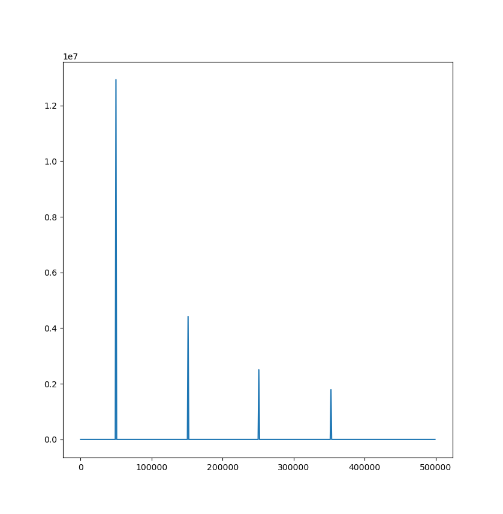
<center> 图8 SNR=5dB时方波经过粗筛后的谱线 </center>

由图8可见,SNR=5dB时,仅仅经过粗筛筛选出有效的局部极大值,频谱就已经是可用状态了。在此,我们使用了粗筛之后的点数来判断粗筛之后的频谱质量,质量分类如下:
 - n ≤ 5: 高质量频谱,简单做以下主瓣合并就输出
 - 5 ≤ n ≤ 20: 一般情况,做完主瓣合并后再做一遍支配滤波
 - n > 20: 粗筛后有较多假峰,需要进行更严格的合并处理
以下为关键的支配滤波代码:

```python
def peak_dominant_filtering( #支配滤波,用于排除假峰(假局部极大值)
        peaks_index: list[int],
        spectrum_db: np.ndarray,
        dominance_radius = 10, #寻找范围
        dominance_ratio = 10 #衰减大于10dB则不算做新信号
        ) -> list[int]:
    peaks_merged = []
    current_peak_index = 0 #当前峰值索引
    peak_mask = [False for _ in range(len(peaks_index))]
    peak_mask[current_peak_index] = True
    for i in range(1,len(peaks_index)):
        if peaks_index[i] - peaks_index[current_peak_index] <= dominance_radius:
            #检测到主瓣半径内有比自己更大的值,以该值为中心进行计算
            test1 = spectrum_db[peaks_index[i]]
            test2 = spectrum_db[peaks_index[current_peak_index]]
            
            if spectrum_db[peaks_index[i]] >= spectrum_db[peaks_index[current_peak_index]]:
                peak_mask[i] = True
                #如果后面有一个幅值差距很大的峰,则记当前谱线为假峰
                if spectrum_db[peaks_index[i]] - spectrum_db[peaks_index[current_peak_index]] >= dominance_ratio:
                    peak_mask[current_peak_index] = False
                current_peak_index = i

        else:
            peak_mask[i] = True
            current_peak_index = i

    for i in range(len(peaks_index)):
        if peak_mask[i]:
            peaks_merged.append(peaks_index[i])

    return peaks_merged
```

具体执行逻辑如下:如果两个bin的距离过近(小于dominance_radius),那么检查它们之间的幅度差,如果两bin幅值之差大于10dB,则表明较小的那个峰是假峰。

#### 2.4.4 测试及结果
为验证幅值查询算法的有效性,使用基波频率=$\frac{f_s}{10}$ ,点数1024点的方波与三角波进行测试,并且将频率偏移0.5bin以测试频谱泄漏情况下的算法鲁棒性。输入信号加hann窗。
经过测试,总体测试性能良好,但是高次谐波情况下会出现假峰,由于假峰离高次谐波较远,且幅值与真的高次谐波相近,所以在此阶段先不进行处理。
##### 2.4.4.1 三角波测试结果
三角波在低snr和高snr下测试结果良好,在SNR=10dB情况下能识别出三次谐波,20dB时可识别出五次谐波(有时可识别出七次谐波),30dB时可识别出九次谐波(其中九次谐波有假峰,需要进行额外处理)

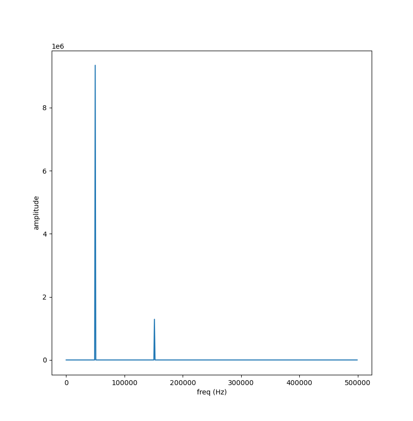
<center> 图9 SNR=10dB时三角波筛选后的频谱(线性谱) </center>


<center> 图10 SNR=20dB时三角波筛选后的频谱(线性谱) </center>

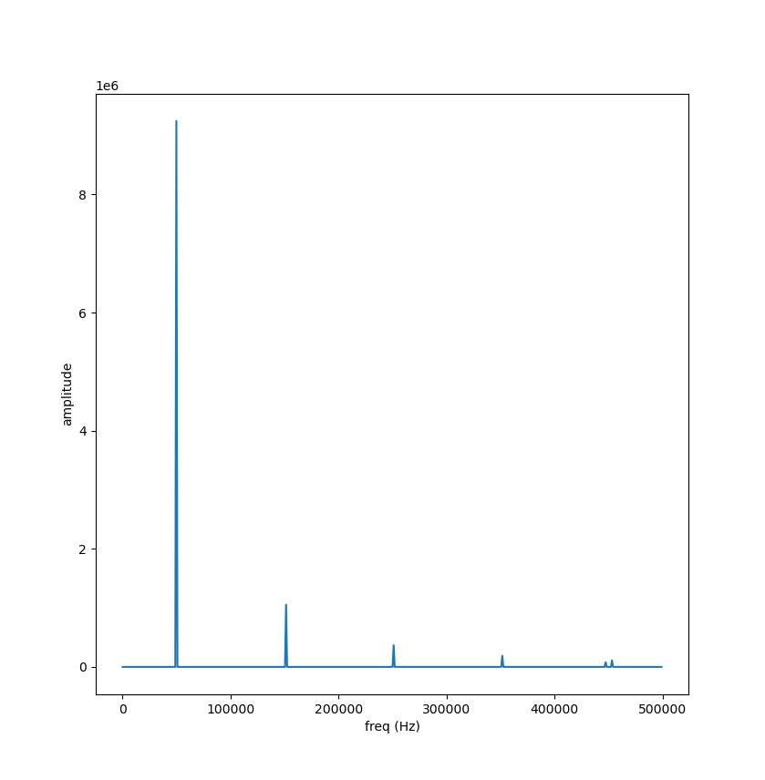
<center> 图11 SNR=30dB时三角波筛选后的频谱 </center>

如图11所示,当SNR ≥ 30dB时,波形筛选能够筛选出九次谐波,但是略微有假峰。由于高次谐波的假峰与真实值幅值过近,因此这里我选择了不做任何处理,保留高次谐波假峰的方案(电赛波形分析也基本用不到九次谐波)
>注:假峰问题可以通过对齐频率bin(正周期采样)减轻频谱泄漏来缓解

经上测试,可以看出,在SNR≥20dB时,该算法对三角波的频谱发现就能较为准确的还原波形。

##### 2.4.4.2 方波测试结果
方波由于其幅值衰减较慢,所以假峰问题较为严重,但是在高SNR(SNR≥30)的环境下表现良好。以下为方波的测试结果:

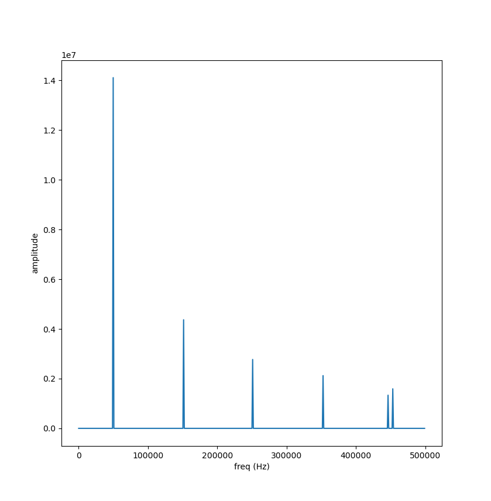
<center> 图12 SNR=10dB时方波筛选后的频谱(有假峰) </center>

方波在SNR=10时就可以观测到显著的九次谐波,不过其在低SNR时假峰问题较为严重

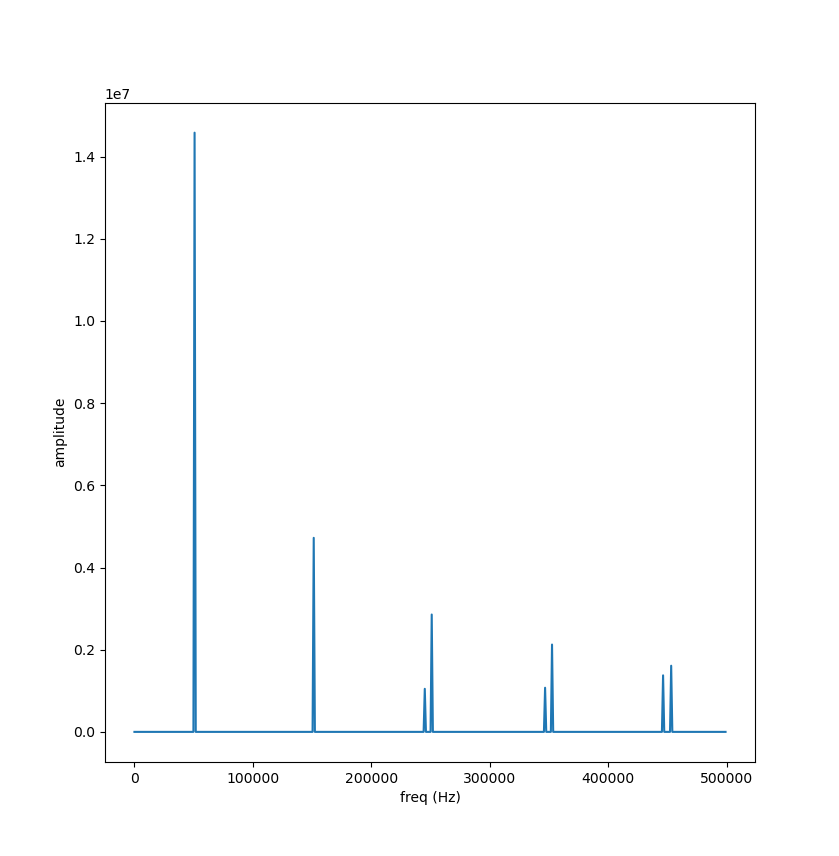
<center> 图13 SNR=20dB时方波筛选后的频谱</center>

如图13所示,假峰在SNR=20dB左右时最严重,可以注意到:方波的五、七、九次谐波都存在假峰,但该情况在SNR=30dB情况时就会极大缓解

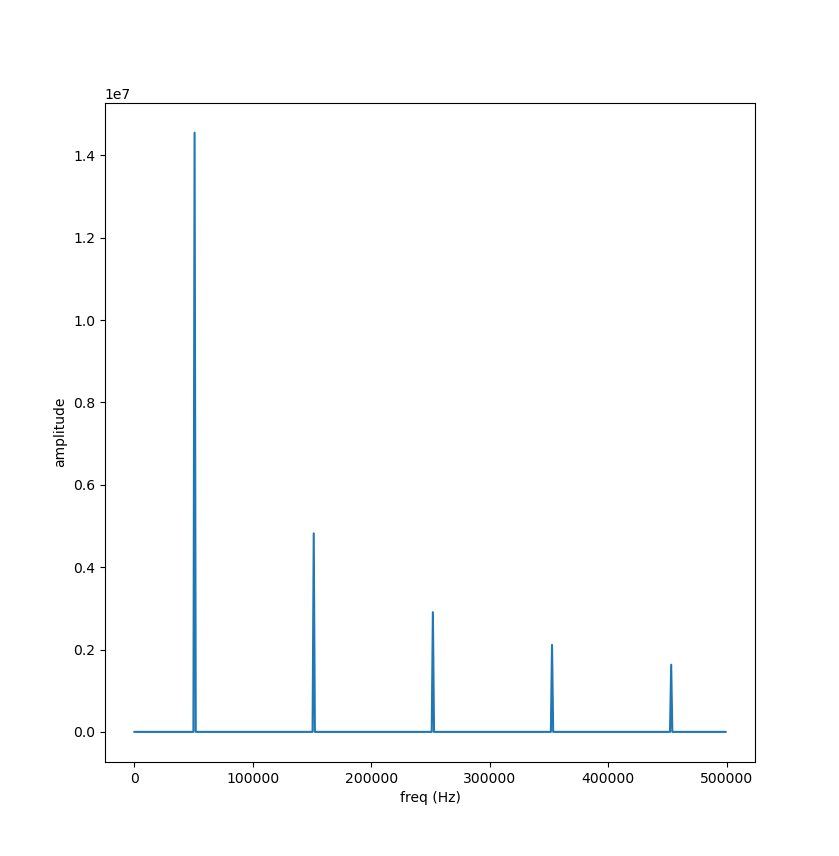<center> 
图14 SNR=30dB时方波过滤后的频谱 </center>

SNR ≥ 30dB时,方波的假峰基本全部消失

### 3.总结
其实如果能在MCU上将这些算法实现出来,我感觉完成像2023年H题这种只看幅值,而且对精度要求较为一般的频谱分析还是没有什么问题的,但是对于一些测量精度较高的电赛题,仍然无法胜任。下一节中,我们将着眼于插值算法,重构原有的插值算法,并且添加几种新的,精度更高的插值算法,以适配更高的频率,幅值测量要求。另外,由于FFT后的相位谱往往误差较大,我们还需要添加相位的矫正算法。
(实际上是文章太长了分两篇发)

## 版权声明

[记一次fft模块重构(一):基础仿真篇](https://blog.05262025.xyz/posts/2026-06-14-记一次fft模块重构一基础仿真篇/) © 2026 by [高三小祥](https://github.com/jmc0x68) is licensed under [CC BY-NC-SA 4.0](https://creativecommons.org/licenses/by-nc-sa/4.0/)
文中所有图片著作权均归版权方所有
